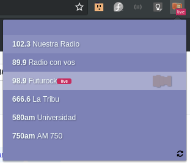
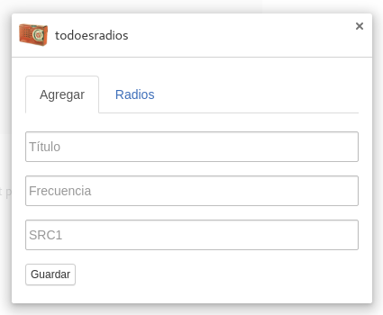
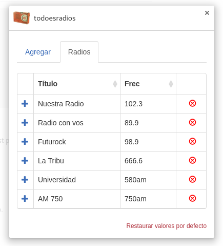

# todoesradios

Excusa de porque esto:

> todo el p#$% día sentado frente a la compu "laburando" y escuchando radio

Me canse de tener 5 o 6 tabs abiertos con las radios que escucho, después pase a usar paginas como la exquisita [https://pewen.github.io/radios/comunitarias/](https://pewen.github.io/radios/comunitarias/).
Y como en realidad solo escucho 5 o 6 y tenia un poco de tiempo (y mis épocas de hacer todo por CLI medio que paso) hice este coso que esta re mal hecho pero que anda (mas o menos) bien para lo que necesito.

## datos técnicos
Uso [howler.js](howlerjs.com) para reproducir casi todo excepto los _m3u8_ que uso [hls.js](https://github.com/video-dev/hls.js/).

## PRs!
Si! ... por favor! Cualquier cosa que le de un poco de onda es re bienvenida ya que tengo el sentido estético de una babosa.

## screenshots

